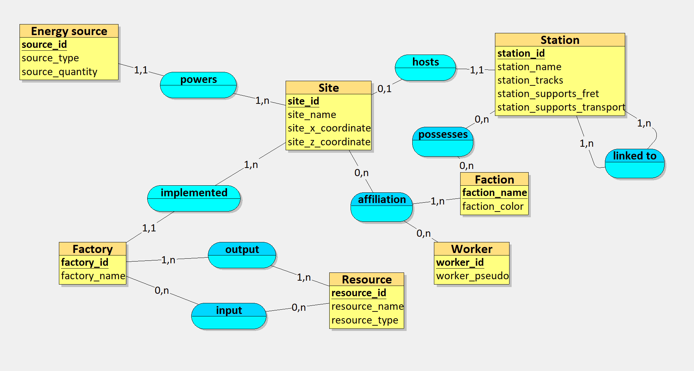

# ProuteauVeclin DataBase Projetct Int2
# I - The prompt we used for our project
  We were going for a project linked to minecraft, and partucularly the mod create in which we would organize a production chain, with different factories, workers 
  and train stations to link them all. \
  You work in the field of Minecraft server administration and in-game industrial automation using the Create mod. Your Minecraft server faction is involved in the domain of in-game logistics, energy management, automated production, and railway networks routing. \
  It is a Minecraft server faction such as FICSIT Inc. (from the game Satisfactory) or a major player-run corporation in EVE Online. Data about energy sources (e.g., water wheels, steam engines), production sites, automated factories, train stations and track links, player-run companies, server members acting as workers, and resources required or produced (e.g., andesite alloy, crushed ores, rotational force) has been collected. Take inspiration from the following  website : the official Minecraft Create Mod Wiki.\
Your Minecraft server faction wants to apply MERISE to design an information system. You are responsible for the analysis part, i.e., gathering the company's requirements. It has called on a computer engineering student to carry out this project, and you must provide him with the necessary information so that he can then apply the following steps of database design and development himself.
First, establish the data business rules for your Minecraft server faction in the form of a bulleted list. It must correspond to the information provided by someone who knows how the company works, but not how an information system is built.
Next, based on these rules, provide a raw data dictionary with the following columns, grouped in a table: meaning of the data, type, size in number of characters or digits. There should be between 25 and 35 data items. It is used to provide additional information about each data item (size and type) but without any assumptions about how the data will be modeled later.
Provide the business rules and the data dictionary.
# II - The output of the AI 

## Business Rules

These rules describe how our faction operates regarding energy generation, factory logistics, and railway networks. 

* **Sites and Geography:** Our operations are distributed across various geographical sites. Every site is defined by a unique identifier, a name, and its X and Z coordinates in the Minecraft world.
* **Energy Management:** To power our operations, we build various energy sources (like water wheels or steam engines). Every single energy source is dedicated to powering exactly one specific site. However, a large site can be powered by several different energy sources simultaneously.
* **Factories and Implementation:** We construct automated factories to process materials. A given factory is built on one, and only one, specific site. Naturally, a large site can host multiple different factories.
* **Production and Requirements:** Factories act as our production hubs. A factory can require different types of resources (input) to operate, and it produces at least one type of resource (output). 
* **Resource Tracking:** Resources can be items, contraptions or fluids. A specific type of resource can be produced by multiple different factories across our server. Similarly, a resource might be required by multiple factories as an input, or not required by any (if it is an end-product).
* **Railway Stations:** To move goods and players, we build train stations. If a site has a station, it will never have more than one. Conversely, a specific train station is always built at exactly one site. 
* **Station Capabilities and Network:** Stations are identified by a unique name. We track how many tracks each station has, and whether it supports freight trains, passenger transport, or both. To form our railway network, every station must be physically linked to at least one other station.
* **Factions and Ownership:** There are multiple player-run factions on the server, identified by their name and a representative color. Factions can take ownership of train stations. A faction can possess multiple stations, and for cooperative hubs, a single station can be jointly possessed by several factions.
* **Workers and Affiliations:** Server members act as workers. We assign workers to specific sites under the banner of a specific faction. A worker can take on multiple assignments across different sites and factions over time.

---

## Raw Data Dictionary

This table outlines all the raw data points gathered during the analysis phase. It includes base attributes as well as relational data points that the student will later normalize into a proper database schema.

| Meaning of the Data | Type | Size (Chars/Digits) |
| :--- | :--- | :--- |
| **1.** Unique identifier for an energy source | Alphanumeric | 10 |
| **2.** Type of energy source (e.g., water wheel, steam engine) | Text | 30 |
| **3.** Output quantity generated by the energy source | Numeric | 10 |
| **4.** Unique identifier for a geographical site | Alphanumeric | 10 |
| **5.** Name of the geographical site | Text | 50 |
| **6.** Site's X coordinate in the Minecraft world | Numeric | 8 |
| **7.** Site's Z coordinate in the Minecraft world | Numeric | 8 |
| **8.** Unique identifier for a train station | Alphanumeric | 10 |
| **9.** Name of the train station | Text | 50 |
| **10.** Number of tracks present at the station | Numeric | 2 |
| **11.** Indicates if the station supports freight logistics | Boolean | 1 |
| **12.** Indicates if the station supports player transport | Boolean | 1 |
| **13.** Unique name of a player faction | Text | 50 |
| **14.** Color representing the faction | Text | 30 |
| **15.** Unique identifier of a worker | Alphanumeric | 15 |
| **16.** Minecraft username (pseudo) of the worker | Text | 16 |
| **17.** Unique identifier for an automated factory | Alphanumeric | 10 |
| **18.** Name of the automated factory | Text | 50 |
| **19.** Unique identifier for a resource | Text | 50 |
| **20.** Name of the resource (e.g., Andesite Alloy) | Text | 50 |
| **21.** Type/category of the resource (e.g., fluid, item) | Text | 20 |
| **22.** ID of the site powered by a specific energy source | Alphanumeric | 10 |
| **23.** ID of the site where a specific factory is implemented | Alphanumeric | 10 |
| **24.** ID of the station hosted at a specific site | Alphanumeric | 10 |
| **25.** Name of a station linked in the railway network | Text | 50 |
| **26.** Name of a faction that possesses a specific station | Text | 50 |
| **27.** ID of a resource produced by a specific factory | Text | 50 |
| **28.** ID of a resource required as input by a specific factory | Text | 50 |
| **29.** ID of the site where a worker is actively affiliated | Alphanumeric | 10 |
| **30.** Name of the faction to which a worker is actively affiliated | Text | 50 |

# III - The MCD File we created

